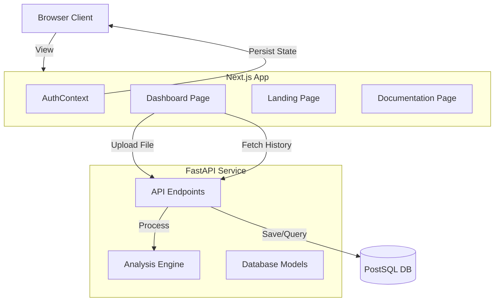

# DNA Sequence Analyzer - Technical Architecture Guide

This document provides a technical overview of the DNA Sequence Analyzer application. It is designed to help developers and interviewers understand the system architecture, component interactions, and key implementation details.

## 1. System Overview

The application is a full-stack web platform consisting of:
*   **Frontend**: Built with **Next.js 14** (App Router), React, and Tailwind CSS.
*   **Backend**: A **Python FastAPI** service processing DNA logic.
*   **Database**: **PostgreSQL** (via specific connection string) accessed using **SQLAlchemy**.
*   **Authentication**: A custom context-based mock authentication system.

### Architecture Diagram

---

## 2. Frontend Architecture (`/frontend`)

### Core Technologies
*   **Next.js App Router**: Uses file-system based routing (`app/page.js`, `app/docs/page.js`).
*   **Client Components**: Most interactive pages use `"use client"` for state management.
*   **Tailwind CSS**: Utility-first styling for responsive design.
*   **Lucide React**: Iconography.
*   **Recharts**: Data visualization for mass distribution charts.

### Key Components

#### 1. Context & State Management (`AuthContext.js`)
*   **Purpose**: Manages global user authentication state.
*   **Implementation**: 
    *   Uses `React.createContext`.
    *   Persists user session via `localStorage` to survive page reloads.
    *   Exposes `login()`, `logout()`, `user` object, and `loading` state.
*   **Why**: avoids prop drilling user data through every component.

#### 2. Root Page Logic (`app/page.js`)
*   **Conditional Rendering**: 
    *   If `!user`: Renders the `<LandingPage />` component.
    *   If `user`: Renders the main Dashboard (Upload form, Charts, Tables).
*   **Data Fetching**:
    *   Fetches User History and System Health only when an authenticated user is present.
*   **Report Generation**: Use browser-native `Blob` and `URL.createObjectURL` to generate `.txt` reports on the client side without needing a backend download endpoint.

#### 3. Reusable Components
*   **`LoginDialog.js`**: A modal using fixed positioning and z-indexing. Handles the form submission using the `login` function from `AuthContext`.
*   **`Footer.js`**: A shared footer component used across the Dashboard, Landing Page, and Documentation.
*   **`LandingPage.js`**: A presentation-heavy component with CSS animations (gradients, blur effects).

---

## 3. Backend Architecture (`/backend`)

### Core Technologies
*   **FastAPI**: High-performance Python web framework.
*   **SQLAlchemy**: ORM for database interactions.
*   **Pydantic**: Data validation (though largely handled by SQLAlchemy models here).

### Key Modules

#### 1. API Interface (`api.py`)
*   **`POST /analyze`**:
    *   Accepts `file` (UploadFile) and `username` (Form string).
    *   Reads file bytes -> Decodes to String -> Extracts Nucleotides.
    *   Calls `dna.analyze_dna_sequence`.
    *   Saves result to DB via `AnalysisResult` model.
*   **`GET /history`**: Returns the last 10 analysis records.
*   **`GET /health`**: Simple DB connectivity check.

#### 2. Analysis Logic (`dna.py`)
*   *(Internal Module)* contains the pure python logic to check for:
    *   Start Codon (ATG)
    *   Stop Codons (TAA, TAG, TGA)
    *   Length checks
    *   Mass calculation (A, T, C, G weights)

#### 3. Database Layer (`database.py` & `migrate_db.py`)
*   **`database.py`**: Defines the `AnalysisResult` SQLAlchemy model.
*   **`migrate_db.py`**: A custom lightweight migration script.
    *   Checks if columns (`filename`, `username`) exist.
    *   Uses `ALTER TABLE` to add them safely if missing.
    *   This approach avoids the complexity of full Alembic setup for this scale of project.

---

## 4. Key Design Decisions for Interview Context

1.  **Separation of Concerns**: 
    *   Analysis logic is decoupled from the API layer.
    *   Frontend presentation is decoupled from data fetching.

2.  **Mock Authentication**: 
    *   Instead of implementing a full OAuth/JWT backend (which is complex and security-critical), we modeled the *state management* aspect using React Context. This demonstrates understanding of how auth *flows* work in a SPA without getting bogged down in implementation details.

3.  **Client-Side Report Generation**:
    *   Generating the `.txt` report in the browser saves server resources and bandwidth.

4.  **Graceful Degradation**:
    *   The Health Check mechanism alerts users if the database is offline, displaying a banner instead of crashing the app.

5.  **Schema Migration**:
    *   The `migrate_db.py` script demonstrates an understanding that database schemas evolve (e.g., adding user attribution) and that software needs to handle these changes automatically or via scripts.
